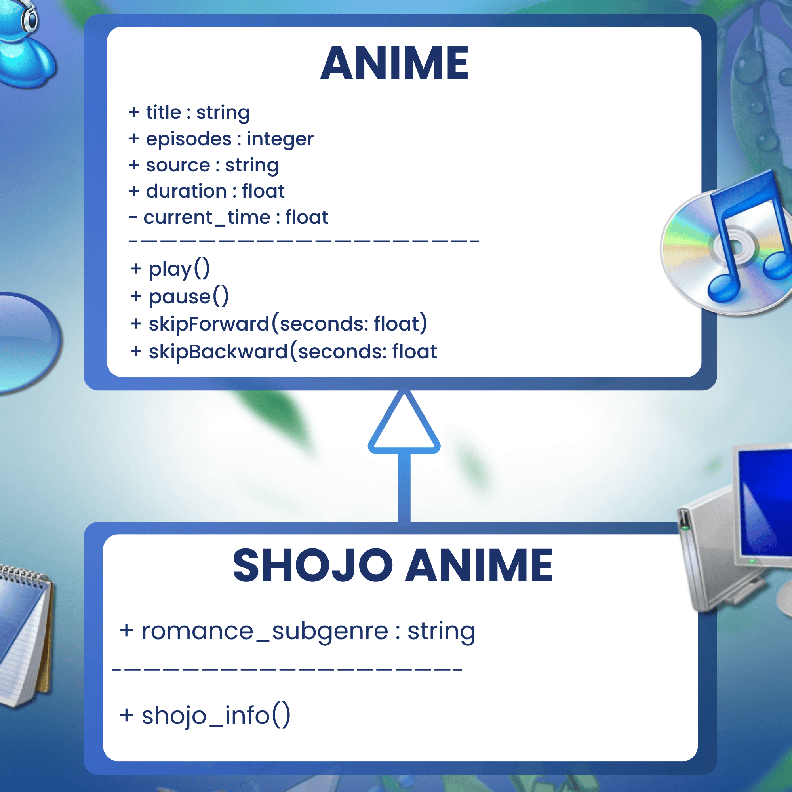
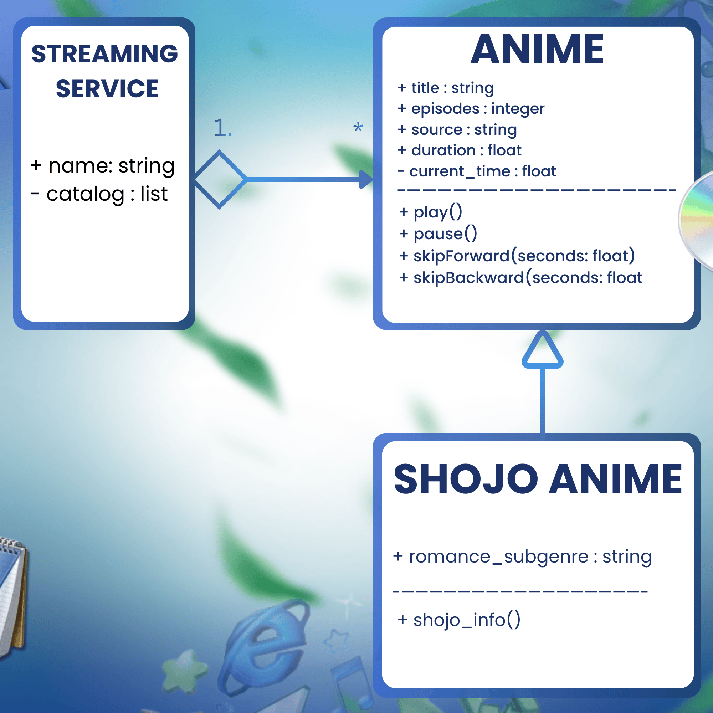
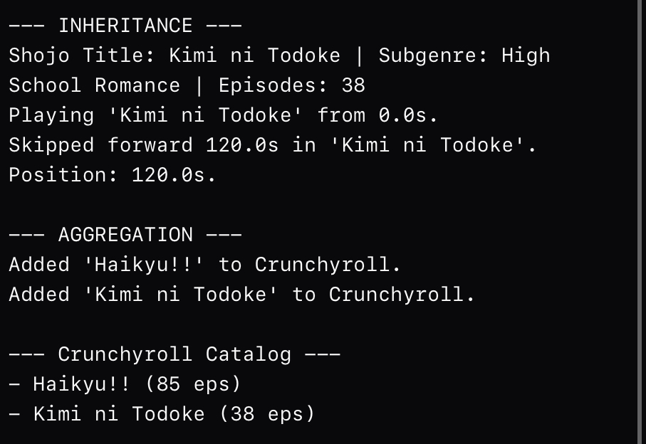
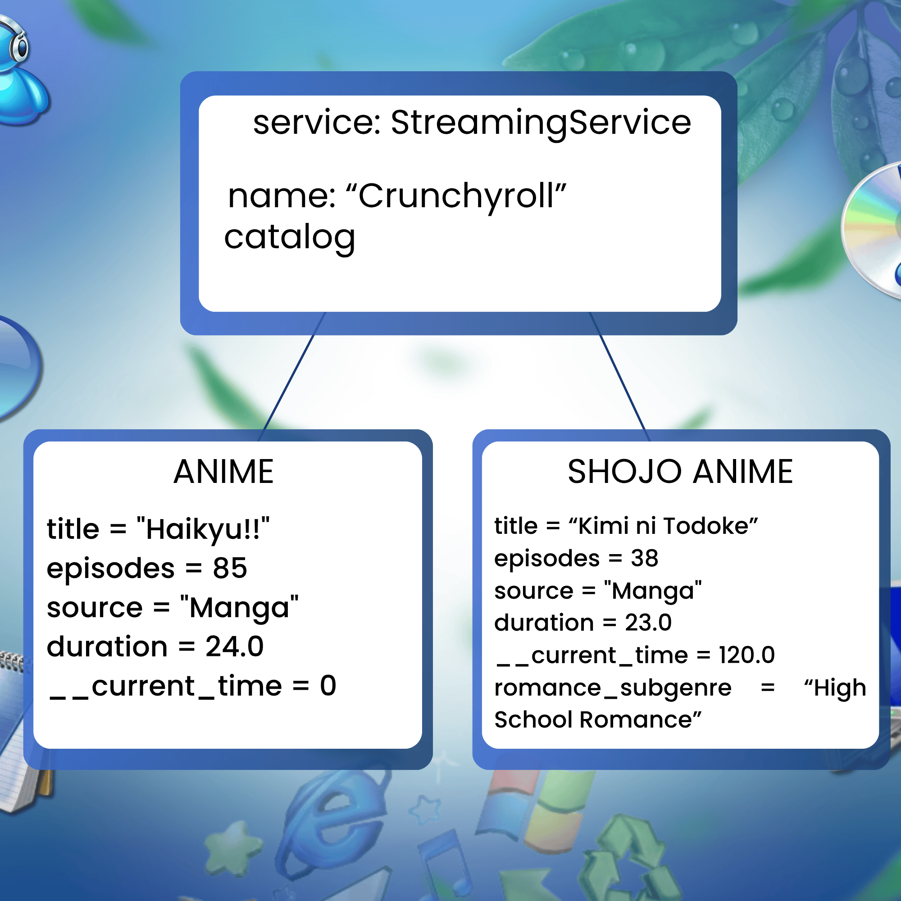

# Advanced Class Relationships
## Previous Activities
[classAttributesMethods](classAttributesMethods.md)

[classRelationships](classRelationships.md)
## Existing System Description: 
The existing system manages a variety of ⁠Anime⁠ series within a ⁠StreamingService⁠ catalog using basic association and multiplicity.
## Inheritance Relationship
Parent: Anime

Child: ShojoAnime

Explanation: ShojoAnime⁠ IS-A specific demographic type of ⁠Anime⁠. It inherits general media properties like title, episodes, source, and duration, along with an additional ⁠romance_subgenre⁠ attribute.
## Inheritance UML

## Composition/Aggregation
Relationship:
Explanation:
## Advanced UML Diagram

## Python Implementation
[Source Code](advancedRelationships.py)
## Test Run

## Object Diagram

## Reflection
Answers:
