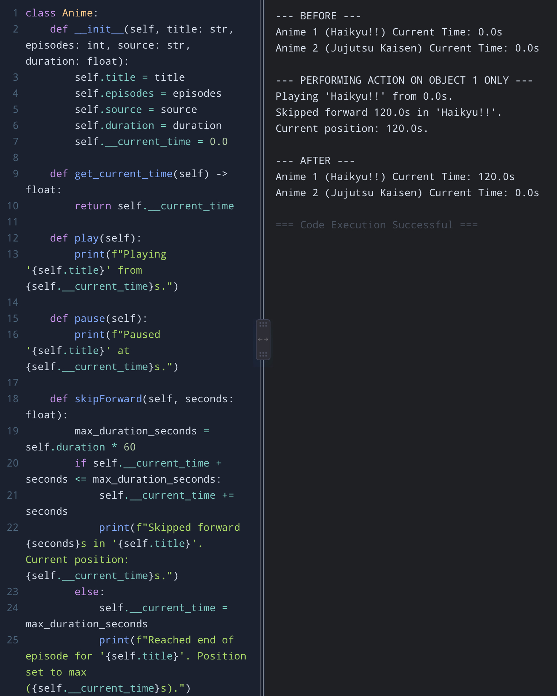
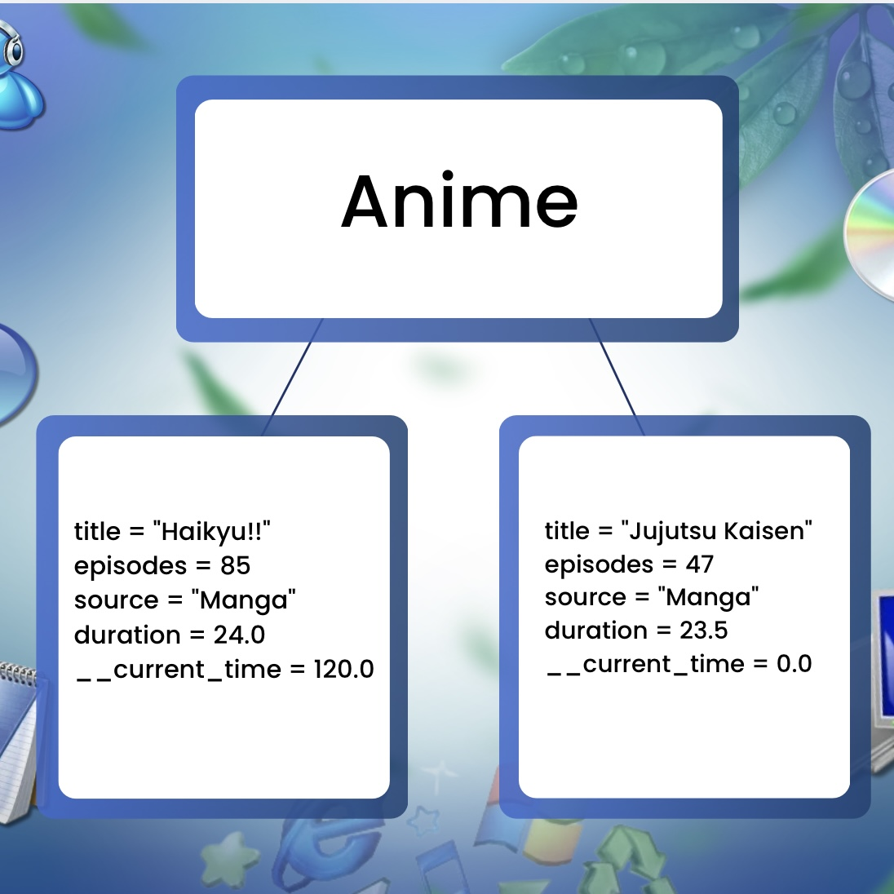

# Class Attributes and Methods
## Previous Design
Link to my previous activity:
[classObjectUML.md](classObjectUML.md)
## Design Revision
Added a private attribute “__current_time” to keep track of the playback timestamp safely.
## Visibility Decisions
| Attribute | Data Type | Visibility | Reason |
|---|---|---|---|
|Title|String|Public | Metadata accessible directly |
|Episodes|Integer |Public |Reference for total episodes|
|Source |String|Public |Origin details |
|Duration|Float|Public |Episode total length in minutes |
|__current_time|Float |Private |To prevent invalid or negative playback timestamps |
## Updated UML Class Diagram

## Python Implementation
[View Python Source](classImplementation.py)
## Test Run

## Object Diagram

## Analysis
### Why did you make your chosen attribute private? 
I made the “__current_time” attribute private to protect the playback system for invalid updates.

### Which method changes the state of your object?
The “skipForward()” method modifies the state of the private “__current_time” attribute. It receives a duration parameter and adds it to the current time.

### How did your two objects demonstrate that instances are independent?
In the test output, calling “skipForward(120.0)” on “Haikyu!!” increased its private “__current_time” from “0.0” to “120.0”. Meanwhile, “Jujutsu Kaisen” retained its initial “__current_time” of “0.0”. This proves that each object maintains its own distinct time.

### What is the difference between your class diagram and your object diagram?
The class diagram specifies variable names and method signatures. On the other hand, the object diagram represents specific runtime instances containing actual values.
