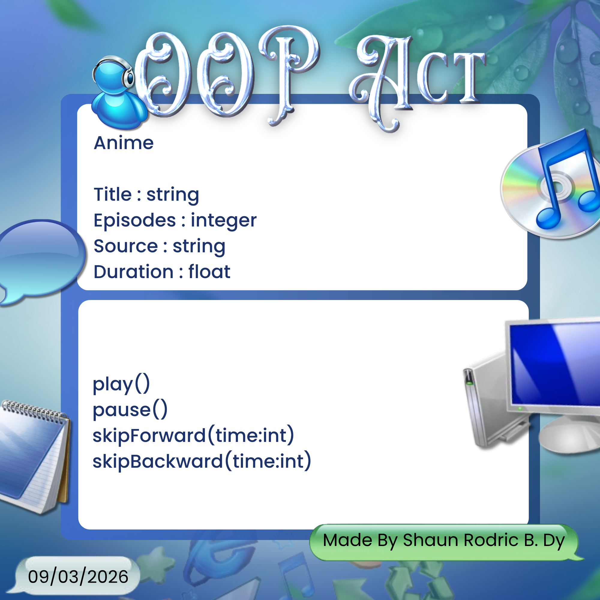

# SG4 - Understanding Classes and Objects
## Class Name: Anime
## Class Description: The class represents the genre of “Anime” in tv shows. Anime is a style of animated entertainment and television shows that originates from Japan
## Properties
| Property | Data Type | Description |
|---|---|---|
|Title |string | title of the anime |
|Episodes |integer |number of episode |
|Source |string |origin of where the anime is based off |
|Duration|float |average runtime of each episode in minutes  |
## Methods
| Method | Description |
|---|---|
|play() |plays the episode|
|pause() |pauses the episode|
|skipForward(time:int) |skips forward a certain time|
|skipBackward(time:int) |skips backward a certain time|
## Class Diagram

## Design Explanation
### Why did you choose this class?
I chose this class because I believe anime has increased in popularity over the years, gaining the interest of teenagers including me. There are a variety of animes with different titles, plots, sources, etc. So I made this class to seperate them.

### Which property is the most important? Why?
I think the most important property is the source. An anime without the source is nothing, the anime bases its episodes on the source and tells the animators what to draw.

### Which method is the most useful? Why?
The most useful method to me is play. An anime cannot progress without playing it first, thus making play the most useful method out of all.
