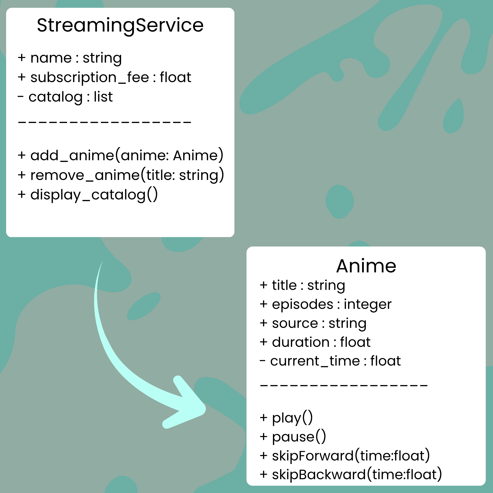
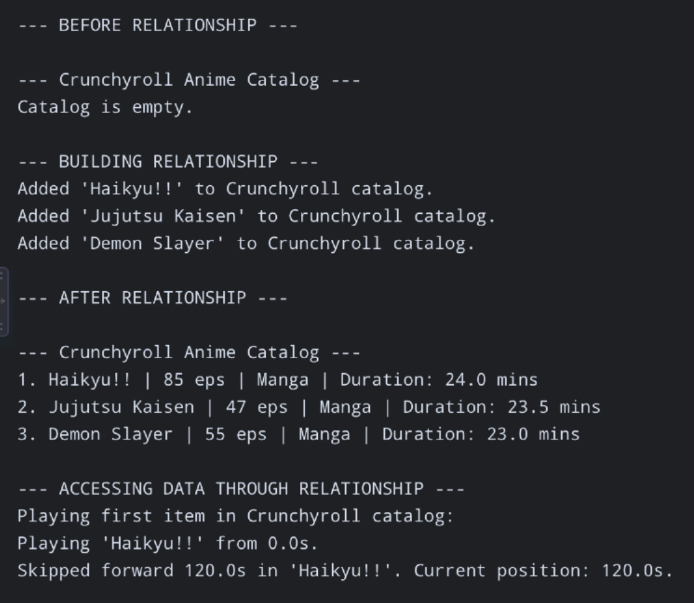

# Class Relationships: Association and Multiplicity
## Previous Work
[Part I - Classes and Objects](classObjectUML.md)
[Part II - Class Attributes and Methods](classAttributesMethods.md)
## Existing Class
Class: Anime
Description: The class represents the genre of “Anime” in tv shows. Anime is a style of animated entertainment and television shows that originates from Japan
## New Related Class
Class: StreamingService
Description: Represents a digital platform that has a catalog of anime.
## Association
Relationship: A StreamingService includes a variety of anime.
Explanation: A StreamingService has a catalog containing multiple individual anime series, allowing global users to browse and play them.
## Multiplicity
Multiplicity: 1 Streaming Service —— 0..* Anime
Explanation: A single StreamingService platform can host zero or many Anime titles in its catalog.
## UML Class Relationship Diagram

## Python Implementation
[View Python Source](classRelationships.py)
## Test Run

## Object Relationship Diagram

## Analysis
### What is the association between your two classes?
A StreamingService object contains and manages multiple Anime objects within its catalog collection. Furthermore, it allows the streaming service to organize media neatly.

### What multiplicity did you choose and why?
I chose 1 to 0..* (One-to-Many) for my multiplicity as a streaming service platform can exist with nothing or it can include a number of anime series. On the other hand, an anime series can have multiple streaming services which also agrees with the One-to-Many multiplicity.

### How did you implement the relationship in Python?
I implemented the relationship in python by initializing a private list attribute named “self.catalog” within the StreamingService class “__init__” method.

### Why did you store an object reference instead of copying its data?
Storing an object reference allows the class to interact with the live state of the object directly without duplicate data storage. 

### If your relationship uses many, why is a list appropriate?
A list is the most appropriate for a "many" relationship as it provides an array structure that can be modified whilst anime are added or removed. Additionally, in the list, it stores the exact memory references of the instantiated objects.

